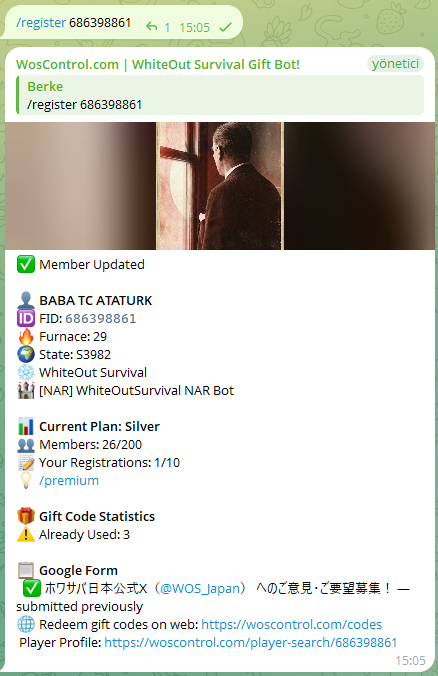
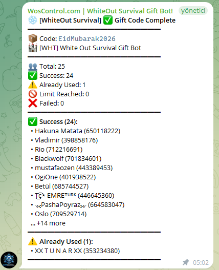
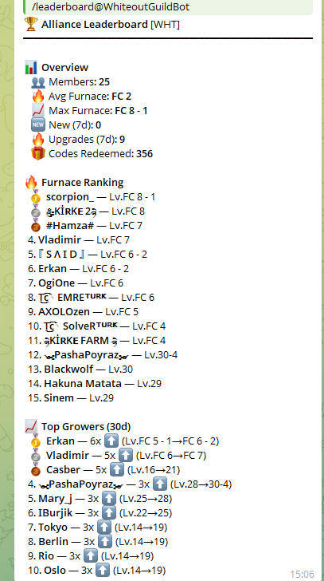

<div align="center">

<a href="https://woscontrol.com">
<h1>🌐 woscontrol.com</h1>
<h3>Multi-Game Gift Code & Alliance Bot Platform</h3>
</a>

<br>

<a href="https://woscontrol.com">

</a>

<br><br>

# ⚔️ Lord Rush Bot

### The Ultimate Gift Code & Alliance Management Bot for Lord Rush

<br>

[](https://t.me/WhiteoutGuildBot)
[](https://discord.com/oauth2/authorize?client_id=1462815590141132905&permissions=8&scope=bot%20applications.commands)
[](https://t.me/btuncsiper)
[](https://t.me/btuncsiper)

<br>

[]()
[](CHANGELOG.md)
[]()
[]()
[]()
[](locales/)
[]()
[](LICENSE)
[]()

<br>

**Automatically discovers and redeems Lord Rush gift codes • Manages your alliance roster**
**Kingdom-aware redemption • No captcha, no login step • Works on Telegram and Discord**

<br>

[🌐 Website](#-wos-control-website) · [✨ Features](#-features) · [⚙️ How It Works](#%EF%B8%8F-how-it-works) · [📋 Commands](#-commands) · [🏆 Leaderboard](#-leaderboard) · [🚀 Get Started](#-get-started) · [🎁 Free Codes](#-get-gift-codes--no-bot-required) · [🤝 Contribute](#-contributing--volunteers-wanted) · [📋 Changelog](CHANGELOG.md) · [❓ FAQ](#-faq)

---

</div>

## ⭐ Source Code Release
> **We're planning to open-source this project!**
> The full source code will be released when this repository reaches **100 ⭐ stars**.
>
> ⭐ **Star this repo** to show your interest and help us reach the goal!
>
> Current progress: 

---

## 🤝 Contributing — Volunteers Wanted!

We keep the bot's Lord Rush gift-code coverage and translations fresh with help from the community. **Two easy ways to help — and you'll be credited!**

<div align="center">

### 🎁 What You Get

| Reward | Details |
|--------|---------|
| 🏆 **Permanent Credit** | Your name is listed as an official contributor |
| 📣 **Bot Recognition** | Credited in the bot's live responses and release notes |
| ⭐ **GitHub Credit** | Listed as a contributor in this repo |
| ❤️ **Community Fame** | Your name lives on in every alliance that uses the bot |

</div>

> 🎯 **How to help:**
> - 🎁 **Report new gift codes** — spot a fresh Lord Rush code before the bot does? Send it in and we'll add it for everyone.
> - 🌐 **Add or improve a translation** — help translate the bot into your language (see [CONTRIBUTING.md](CONTRIBUTING.md)).
>
> **Contact us directly:**
> - **Telegram:** [@btuncsiper](https://t.me/btuncsiper)
> - **Discord:** [@hasmetli](https://discord.com/users/hasmetli)

### ✅ Current Contributors

> *Be the first — get your name seen by thousands of Lord Rush players!*
> <!-- Contributors list is updated manually -->

---

## 🔢 Latest Version: v5.0.0

> **Released:** 2026-07-24

  - **Lord Rush Support**: Full gift-code + alliance management for **Lord Rush**, live 24/7 on Telegram and Discord
  - **Automatic Gift Code Redemption**: Codes are discovered, validated, and redeemed for every member automatically — a single signed request per account, kingdom-aware, with no captcha and no login step
  - **`/register [FID]`**: Members register with their Fighter ID; registration collects your kingdom number so codes always reach the right account
  - **Leaderboard & 5 Languages**: `/leaderboard` rankings plus full localization in English, 日本語, 한국어, Русский, and Türkçe

> 📋 **[Full Changelog →](CHANGELOG.md)**

---

## 🎯 What Is This?
**Lord Rush Bot** is a fully automated, production-grade management bot designed specifically for **Lord Rush** (Century Games) alliance leaders and members. It runs **24/7 on a dedicated server**, monitoring for new gift codes and redeeming them instantly for every registered member in your alliance.

The bot operates on both **Telegram** and **Discord** simultaneously, with a shared database ensuring full cross-platform synchronization. Everything from gift code redemption to member management is completely automated — no manual intervention required.

> 💡 **No more missed gift codes.** The bot scans for new codes every **5 minutes**, validates them, and redeems them for your entire alliance automatically — in a single signed call per account.

---

## 🌐 WOS Control Website

> **Everything in one place** — the bot has a full web platform at **[woscontrol.com](https://woscontrol.com)**, which now supports Lord Rush.

<div align="center">

| Feature | Link | Description |
|---------|------|-------------|
| 🏠 **Home** | [woscontrol.com](https://woscontrol.com) | Overview, features & quick start |
| 🎁 **Gift Codes** | [woscontrol.com/codes](https://woscontrol.com/codes) | Live code list — auto-updated every 5 min |
| 🤝 **Recruitment** | [woscontrol.com/recruitment](https://woscontrol.com/recruitment) | Alliance recruitment board |
| 🏆 **Leaderboard** | [woscontrol.com/leaderboard](https://woscontrol.com/leaderboard) | Alliance & member rankings |
| 💬 **Live Chat** | [woscontrol.com/chat](https://woscontrol.com/chat) | Alliance live chat system |

</div>

### 📸 Screenshots

<div align="center">

 &nbsp; 



</div>

> 📷 Screenshots are being refreshed for Lord Rush — the operator will update these shortly.

---

## ✨ Features

### 🎁 Automatic Gift Code Redemption
- **Automatic scanning** for new codes every **5 minutes**
- **Instant validation** against the official Lord Rush gift-code API
- **Single signed request** — one `POST /gift_code` per account, **no captcha, no login step**
- **Kingdom-aware** — every redemption sends your kingdom id (`kid`) so codes land on the right account
- **Batch redemption** for all alliance members with **hundreds of concurrent requests** per batch
- **Smart retry system** with exponential backoff for transient failures
- **Per-member tracking** — see exactly which codes succeeded, failed, or were already used
- **Notifications** — new code alerts sent and **pinned** in your group automatically

### 👥 Alliance Member Management
- **Quick registration** — members type `/register [FID]` and set their kingdom, and they're in
- **Kingdom collection** — because Lord Rush redeems per kingdom, registration asks for your kingdom number up front
- **Admin add/remove** — manage the roster with `/addmember` and `/removemember`
- **Member export** — export your full member list as a file

### 🏆 Leaderboard
- **Alliance & member rankings** by codes redeemed and activity
- **Podium, tiers & badges** on the website
- **Cross-platform** — one shared leaderboard across Telegram and Discord

### 🌐 Multi-Platform & Multi-Language
- **Telegram + Discord** — full feature parity, shared database
- **English, 日本語, 한국어, Русский, Türkçe** — per-group language configuration
- **Cross-platform sync** — register on Telegram, see data on Discord (and vice versa)
- **🆕 Want to add your language?** Translation files are in [`/locales/`](locales/)

### 👑 Premium & Subscription System
- Tiered plans with configurable member limits
- Subscription expiry warnings (7, 3, 1 day)
- Grace period after expiry (3 days full access)
- Stripe payment integration (optional)

---

## ⚙️ How It Works

### System Architecture
```
┌───────────────────────────────────────────────────────────────────┐
│                    Dedicated Server (24/7)                         │
├───────────────────────────────────────────────────────────────────┤
│                                                                   │
│   📡 Gift Code Scanner            🎁 Redemption Engine           │
│   ┌─────────────────────┐         ┌────────────────────────────┐  │
│   │ Scans for new codes │         │ Single signed POST         │  │
│   │ every 5 min         │         │ per (fid, kid)             │  │
│   │ Validates via API   │         │ Kingdom-aware, no captcha  │  │
│   │ Stores in database  │         │ Hundreds concurrent/batch  │  │
│   └─────────┬───────────┘         └─────────────┬──────────────┘  │
│             │                                   │                 │
│   ┌─────────▼───────────────────────────────────▼──────────────┐  │
│   │                    PostgreSQL Database                      │  │
│   │  users · alliance_list · gift_codes · user_giftcodes       │  │
│   │  alliancesettings                                          │  │
│   └─────────┬───────────────────────────────────┬──────────────┘  │
│             │                                   │                 │
│   ┌─────────▼───────────┐         ┌─────────────▼──────────────┐  │
│   │   Telegram Bot      │         │     Discord Bot            │  │
│   │   python-telegram-  │         │     discord.py v2          │  │
│   │   bot v21 (async)   │         │     Slash commands         │  │
│   └─────────────────────┘         └────────────────────────────┘  │
│                                                                   │
└───────────────────────────────────────────────────────────────────┘
```

### Gift Code Redemption Flow
```
  New codes scanned (every 5 min)
              │
              ▼
     ┌─────────────────┐
     │  New code found  │
     │  & validated     │
     └────────┬────────┘
              │
     ┌────────▼────────┐
     │  Notify all      │──── 📌 Message pinned in group
     │  alliance groups │
     └────────┬────────┘
              │
     ┌────────▼────────┐
     │  Redeem for all  │──── Single signed POST /gift_code
     │  members         │──── Kingdom-aware · no captcha
     └────────┬────────┘
              │
       ┌──────┴──────┐
       ▼             ▼
  ┌─────────┐  ┌──────────┐
  │✅ Success│  │❌ Failed  │
  │ Tracked │  │ Queued   │
  │ in DB   │  │ for retry│
  └─────────┘  └──────────┘
```

---

## 📋 Commands

### 👤 Player Commands
| Command | Description |
|---------|-------------|
| `/start` | 🚀 Start the bot and see overview |
| `/help` | ❓ Help and command reference |
| `/register [FID]` | 📝 Register your game account with your FID (and kingdom) |
| `/codes` | 🎁 View all known gift codes and their status |
| `/leaderboard` | 🏆 Alliance & member rankings |
| `/language` | 🌐 Change your language preference |
| `/premium` | 👑 View subscription plan and usage limits |
| `/changelog` | 📋 View bot version history |
| `/support` | 💬 Contact support |

### 🏰 Alliance Management
| Command | Description |
|---------|-------------|
| `/setupalliance` | 🏗️ Create a new alliance (interactive guided setup) |
| `/alliance` | 🏰 View alliance information |
| `/setgroup` | 🔗 Link current group to an alliance |
| `/members [TAG]` | 👥 View all members in an alliance |
| `/export` | 📄 Export member list |

### 👥 Member Operations
| Command | Description |
|---------|-------------|
| `/addmember [FID] [TAG]` | ➕ Add a member to your alliance |
| `/removemember [FID] [TAG]` | ➖ Remove a member |
| `/delete` | 🗑️ Delete your own account |

### 🛡️ Admin Tools
| Command | Description |
|---------|-------------|
| `/admins` | 🛡️ Manage alliance admins |
| `/panel` | ⚙️ Alliance control panel |
| `/usecode [CODE]` | 🎫 Manually redeem a gift code for your alliance |
| `/addcode [CODE]` | 📌 Manually add a gift code |
| `/stats` | 📊 Bot statistics |
| `/broadcast` | 📢 Send announcement to all groups |
| `/managemembers` | 👥 View member gift code eligibility |

---

## 🏆 Leaderboard

The `/leaderboard` command ranks your alliance and its members by real activity.

### What It Shows
- **Top Alliances** — ranked by total gift codes redeemed and active members
- **Top Members** — most codes redeemed within your alliance
- **Podium & Tiers** — a winners' podium with tier rankings and badges on [woscontrol.com/leaderboard](https://woscontrol.com/leaderboard)
- **Cross-Platform** — one shared leaderboard across Telegram and Discord

---

## 🚀 Get Started

### Quick Setup (5 minutes)
**1.** Add the bot to your Telegram group or Discord server
**2.** Run `/setupalliance` and follow the guided setup
**3.** Have your members type `/register [FID]` and set their kingdom
**4.** Gift codes are redeemed automatically — sit back and relax! 🎉

### Add to Telegram
[](https://t.me/WhiteoutGuildBot)

> Search for `@WhiteoutGuildBot` in Telegram, add the bot to your alliance group and run `/start`.

### Add to Discord
[](https://discord.com/oauth2/authorize?client_id=1462815590141132905&permissions=8&scope=bot%20applications.commands)

> Click the button above to invite the bot. Use `/start` in your server to begin.

### 🆓 Free Trial
Contact us for a **free trial** with full access to all features:

[](https://t.me/btuncsiper)

---

## 🎁 Get Gift Codes — No Bot Required

Don't have the bot set up yet? You can still get **Lord Rush gift codes** redeemed for your account instantly.

<div align="center">

[](https://t.me/btuncsiper)

[](https://woscontrol.com/codes)

</div>

> 📋 **How it works:**
> 1. Find all active codes at **[woscontrol.com/codes](https://woscontrol.com/codes)**
> 2. Contact [@btuncsiper](https://t.me/btuncsiper) on Telegram with your **FID** and **kingdom number**
> 3. All active gift codes get redeemed for your account — instantly, no registration needed
> 4. Add the bot to your alliance group for permanent, fully automatic redemption 🚀

---

## 📖 Guides

### How to Find Your FID
Your **FID (Fighter ID)** is your unique player identifier in Lord Rush.

1. Open **Lord Rush**
2. Tap your **avatar / profile** in the top-left corner
3. Your **FID** is displayed on your player info screen

> 💡 Your FID is a number like `123456789`. Copy it and use `/register 123456789` to register with the bot. You'll also be asked for your **kingdom number** — codes are redeemed per kingdom, so this makes sure they reach the right account.

---

## 🛠 Tech Stack

| Component | Technology | Details |
|-----------|-----------|---------|
| **Language** | Python 3.13+ | Fully async/await architecture |
| **Telegram API** | python-telegram-bot v21 | Async-native, conversation handlers |
| **Discord API** | discord.py v2.x | Slash commands, embeds, views |
| **Database** | PostgreSQL 15+ | Connection pooling, composite keys |
| **HTTP Client** | aiohttp | Async API calls, session management |
| **CAPTCHA Solver** | ONNX Runtime (local) | Platform capability — **not needed for Lord Rush** (redeem is a single signed call, no captcha) |
| **Proxy** | Residential rotating proxies | Rate limit avoidance |
| **Hosting** | Dedicated Server | 24/7 uptime, Windows Server |
| **Payments** | Stripe (optional) | Subscription management |

### Performance Configuration
| Parameter | Value | Description |
|-----------|-------|-------------|
| Gift Code Scan Interval | **5 minutes** | How often new codes are checked |
| Gift Code Batch Size | **hundreds concurrent** | Code redemption parallelism |
| Redemption Call | **single signed POST** | One `/gift_code` per `(fid, kid)` — no captcha, no login |

### Architecture Highlights
- **Single-process dual-bot** — Telegram and Discord run concurrently in one process
- **Shared PostgreSQL database** — full cross-platform data consistency
- **Modular design** — separate modules for registration, gift codes, alliance, and premium
- **Multi-language locale system** — JSON-based, per-group language settings (EN/JA/KO/RU/TR)
- **Game-type awareness** — all operations scoped by game type (`lr`) for multi-game support
- **Auto GitHub sync** — README, changelog, and locales auto-pushed on version change

---

## 🌐 Supported Languages

| Language | Code | Status |
|----------|------|--------|
| 🇬🇧 English | `en` | ✅ Full |
| 🇯🇵 日本語 | `ja` | ✅ Full |
| 🇰🇷 한국어 | `ko` | ✅ Full |
| 🇷🇺 Русский | `ru` | ✅ Full |
| 🇹🇷 Türkçe | `tr` | ✅ Full |

Language files are in the [`locales/`](locales/) directory.

> 🆕 **Want to add your language?** Fork the repo, copy `locales/en.json`, translate it, and submit a PR!

---

## ❓ FAQ
<details>
<summary><b>How do I find my Lord Rush player ID (FID)?</b></summary>

Open Lord Rush → Tap your avatar / profile (top-left corner) → Your FID is displayed on your player info screen. It's a number like `123456789`. When you register, you'll also be asked for your **kingdom number**, since codes are redeemed per kingdom.
</details>

<details>
<summary><b>Is this bot safe to use?</b></summary>

Absolutely. The bot uses the **official gift code redemption API** — the exact same endpoint the game's own website uses. It does **not** access your game account, modify your game data, or require your password. Redemption is a single signed request; there is no login step.
</details>

<details>
<summary><b>How often does the bot check for new gift codes?</b></summary>

Every **5 minutes**. When a new code is discovered, it is validated and redeemed for all registered members within minutes.
</details>

<details>
<summary><b>Why does the bot need my kingdom number?</b></summary>

Lord Rush redeems gift codes **per kingdom** — the redemption request must include your kingdom id (`kid`). Providing your kingdom at registration guarantees every code lands on the correct account.
</details>

<details>
<summary><b>Can I use this bot for multiple alliances?</b></summary>

Yes! Each alliance has its own configuration, member list, language setting, and notification channels. Premium plans allow managing more alliances with higher member limits.
</details>

<details>
<summary><b>What languages are supported?</b></summary>

**English**, **日本語** (Japanese), **한국어** (Korean), **Русский** (Russian), and **Türkçe** (Turkish). Each group can independently set their preferred language.
</details>

<details>
<summary><b>Does this bot work on both Telegram and Discord?</b></summary>

Yes! The bot runs on both platforms simultaneously with a shared database. Register on Telegram and your data is available on Discord too.
</details>

---

## 📞 Contact & Support
[](https://t.me/btuncsiper)

- **Support**: [t.me/btuncsiper](https://t.me/btuncsiper)
- **Bot**: [@WhiteoutGuildBot](https://t.me/WhiteoutGuildBot)
- **Free Trial**: [Request here](https://t.me/btuncsiper)

---

## 📄 License
This project is licensed under the MIT License — see the [LICENSE](LICENSE) file for details.

---

<div align="center">

<a href="https://woscontrol.com">

</a>

<br><br>

**v5.0.0** · Last updated: 2026-07-24

<br>

[](https://t.me/WhiteoutGuildBot)
[](https://discord.com/oauth2/authorize?client_id=1462815590141132905&permissions=8&scope=bot%20applications.commands)
[](https://t.me/btuncsiper)
[](LICENSE)

<br>

**Lord Rush** · **Lord Rush Bot** · **Gift Code Bot** · **Alliance Management** · **Auto Redeem**
**Telegram Bot** · **Discord Bot** · **Free Gift Codes** · **Lord Rush Helper** · **Century Games**

</div>


---

## API Transparency

We continuously datamine **Lord Rush**'s official gift-code client and publish its API surface in the open — every endpoint, the request parameters, and the signature **scheme** (the signing key is published too), plus each change over time. The scan is strictly read-only: it observes the game's public web client and never modifies the API or our redemption keys.


<sub>Baseline mapped 24/07/2026 — redemption is a single signed `POST /gift_code`, kingdom-aware, no captcha; `/player` and `/captcha` answer 404 (removed by Century Games, mirroring their other titles).</sub>

- **[Live API surface →](API_ENDPOINTS.md)** — current endpoints, backend status, payload keys, signature scheme (key included)
- **[Change timeline →](API_DATAMINING.md)** — append-only history of every observed change

<sub>Payload keys are reported as a per-bundle set — minification hides which key belongs to which endpoint.</sub>
